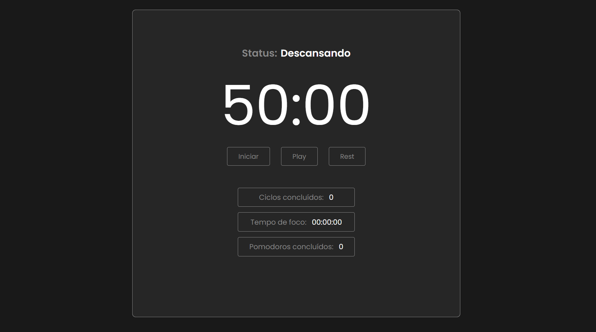

<h1 align="center">Pomodoro APP</h1>

  <a href="#-tecnologias">Tecnologias</a>&nbsp;&nbsp;&nbsp;|&nbsp;&nbsp;&nbsp;
  <a href="#-projeto">Projeto</a>&nbsp;&nbsp;&nbsp;|&nbsp;&nbsp;&nbsp;
  <a href="#-layout">Layout</a>&nbsp;&nbsp;&nbsp;|&nbsp;&nbsp;&nbsp;

 

  

## 🚀 Tecnologias

Esse projeto foi desenvolvido com as seguintes tecnologias:

- HTML
- CSS
- Styled-Components
- TypeScript
- React.JS

## 💻 Projeto

Essa aplicação construída com React.JS e TypeScript trata-se de um pomodoro. Criado para praticar conceitos de TypeScript e me auxiliar nas realizações das tarefas diárias. A lógica por trás da aplicação é bastante simples. Ao clicar em <strong>Iniciar</strong> o cronometro inicia e a partir desse momento a tarefa pode realizada. Quando o cronometro zerar, eu clico em <strong>Rest</strong> para entrar em um modo de descanso curto (5 min). A cada 4 pomodoros concluídos eu ganho um tempo de descanso longo (15 min).

## 🔖 Layout

Você pode visualizar o layout do projeto através [DESSE LINK](https://pomodoro-app-ten-flax.vercel.app/).
